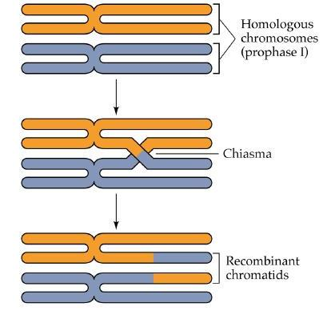
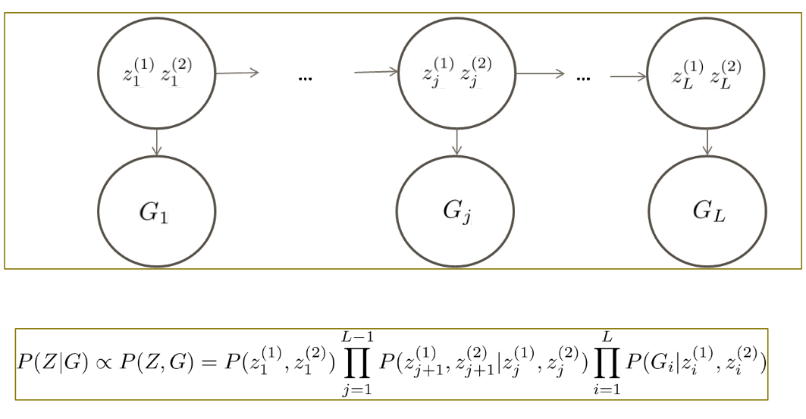

# A big memory example: Genome imputation

(Note: you cannot actually "follow along" with this example, as it involves
human genetic data that I am not at liberty to share)

Processing speed is not the only limiting factor in terms of computational
resources: memory can also be critical.  Here, I illustrate a project I was
involved in that involved large amounts of data and for which the critical
consideration requiring the use of the Argon cluster was its larger memory
capacity.

The example involves genome imputation, which I will now briefly describe.  A
(relatively) inexpensive way of carrying out a genome-wide study is to use a
hybridization chip that probes the genome at a large number of markers.  A more
expensive way is to sequence the entire genome.  A cost-effective compromise is
pay for the chip, but use imputation to fill in the gaps between the markers.
This is made possible by endeavors like the 1000 Genomes Project, which has (so
far) sequenced the genomes of 2,504 individuals and made those sequences
available to the public.

The classical model of genetics is that each human has two copies of each
portion of the genome, and that, during reproduction, parents pass one of those
copies at random to their children.  This is, for the most part, true, but these
random transmissions do not occur independently -- transmissions on the same
chromosome are correlated.  That correlation is fairly complicated, as it
depends on a genetic phenomenon known as crossover:

There are various ways of imputing genomes, but the most accurate rely on hidden
Markov models (HMMs) to infer the unknown genetic blocks (known as "haplotypes")
belonging to individuals in the sample:

Essentially, the observed genotypes (GO) provide information about
the hidden haplotypes (Z), which in turn allow us to infer the unobserved
genotypes (GU) with reasonable accuracy.  Hidden Markov models
themselves are not terribly computer-intensive to fit; it's the sheer size of
genetic data that makes genome imputation computer-intensive and in particular,
memory-intensive.  In particular, imputation for the SOPHIA project (in
collaboration with Profs. Ryckman and Saftlas in Epidemiology) involved nearly
80 Gb of data (some from the actual SOPHIA samples, some from the 1000 Genomes
Project, some of it imputed).

I used a program called MaCH (for Markov Chain Haplotyping) to perform the
imputation (this is now a bit out-of-date with newer versions of software
available, but it illustrates the point).  I won't go through all the details,
but just so you can see how the same ideas of scripting and `qsub` arrays can be
put to use in this problem, I'll share the commands for step 1 of the imputation
process (it's more computationally efficient to do the calculations in two
steps: the first step is called "pre-phasing"; the second step is the actual
imputation).  The script is:


mach1 -d chr$SGE_TASK_ID.dat -p chr$SGE_TASK_ID.ped --rounds 20 --states 200 --interim 5 --phase --sample 5 --prefix chr$SGE_TASK_ID.haps > phase$SGE_TASK_ID.log
cut -f 1 -d " " chr$SGE_TASK_ID.haps.erate | sed -n '1!p' > chr$SGE_TASK_ID.snps
rm chr$SGE_TASK_ID.haps.sample*
rm chr$SGE_TASK_ID.haps.prelim*


Which we run with:


qsub -t 1-22 phase


This runs the hidden Markov model separately on each chromosome 1-22 (i.e.,
simultaneously phasing all 22 chromosomes, one processor per chromosome).  The
process took overnight (about 12 hours), but that's a lot better than 22 nights!

Breaking up the problem in this way is natural to genetics, but the same general
principle of data splitting is widely applied in many other fields involving
"big data".

Image credits: My crossover picture comes from the <a href="http://biology.duke.edu/noorlab/projects.html">Noor lab</a> at Duke; my HMM illustration is from <a href="https://www.cs.cmu.edu/~nihars">Nihar Shah</a> at Carnegie Mellon.
