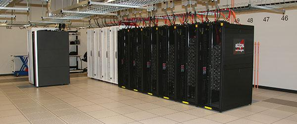

Welcome to my Neon tutorial.  This tutorial is specifically designed for students and faculty in the biostatistics department at the University of Iowa and makes specific references to the all-purpose Biostatistics node, TUKEY.  However, other individuals at Iowa or even other institutions may also find it helpful so long as they pay attention to where commands would have to be modified for their particular setup.

This is designed to be a very simple, hands-on tutorial to help people get started with working on the cluster and doing simple, easily parallelized jobs.  It does not cover more advanced topics like the use of parallel architecture packages in R or compiling C code to carry out multi-threaded operations using MPI or anything like that (although certainly, these are things you can use the Neon cluster for).  Its goal is simply to provide a gentle introduction to the Neon cluster, what it can do, and how you might take advantage of it (because really, it's easier than you think and a lot of things in statistics are very easy to parallelize).

The structure of the documentation is as follows:

* i-iii: This material covers submission of R jobs in non-interactive ("batch") mode and some basic scripting; it has nothing to do with the Neon cluster per se, but you need to know how to do these things before you can run jobs on the cluster.
* 1-10: What Neon is and how to use it: the basic commands are covered and illustrated with a step-by-step example of a simulation that you can try out yourself.
* 11-12: Two somewhat more in-depth examples, one involving a memory-intensive project (genome imputation), the other involving running multiple Markov chains to fit a hierarchical Bayesian model.

The High Performance Computing (HPC) group maintains its own documentation, which is also very useful.  Two particularly useful resources are:

* [Neon overview and quick start guide](https://wiki.uiowa.edu/display/hpcdocs/Neon+Overview+and+Quick+Start+Guide)
* [Cluster systems overview](https://wiki.uiowa.edu/display/hpcdocs/Cluster+Systems+Documentation)

On the more advanced end, Matt Bognar in the Statistics department has an [introduction](http://homepage.stat.uiowa.edu/~mbognar/phi) to using nodes with the Intel Phi coprocessor (a device that allows highly parallel computations with 60 additional cores)

Biostatistics students who would like access to the cluster require a faculty sponsor.  To request access, [apply for a Neon account](http://hpc.uiowa.edu/user-services/apply-account) and fill out the Neon access agreement with your information.  Under "Investor Group (If Any)", write TUKEY.

The Neon machines themselves are physically located in a facility in Coralville; here's a picture of what they look like:

