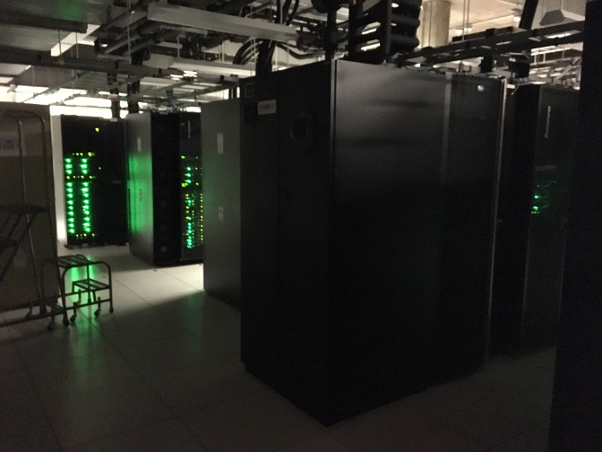

Welcome to this tutorial on using high-performance computing (HPC) resources at the University of Iowa. This tutorial is specifically designed for students and faculty in the Biostatistics department at the University of Iowa and makes references to the all-purpose Biostatistics node, BIOSTAT. However, other individuals at Iowa or even other institutions may also find it helpful so long as they pay attention to where commands would have to be modified for their particular setup.

This is designed to be a very simple, hands-on tutorial to help people get started with working on the cluster and doing simple, easily parallelized jobs. It briefly touches on the use of parallel architecture packages in R, but does not cover more advanced topics like utilizing GPUs or compiling C code to carry out multi-threaded operations (although certainly, these are things you can use the Argon cluster for).  Its goal is simply to provide a gentle introduction to the Argon cluster, what it can do, and how you might take advantage of it (because really, it's easier than you think and a lot of things in statistics are very easy to parallelize).

If you find any errors, outdated links, or bugs, please let one of us (Patrick or Grant) know, or even better, [file an issue](https://github.com/IowaBiostat/hpc/issues).

The structure of the documentation is as follows:

* i-iii: This material covers submission of R jobs in non-interactive ("batch") mode and some basic scripting; it has nothing to do with the Argon cluster per se, but you need to know how to do these things before you can run jobs on the cluster.
* 1-10: What Argon is and how to use it: the basic commands are covered and illustrated with a step-by-step example of a simulation that you can try out yourself.
* 11-12: Customizing your HPC setup
* 13-14: Two examples, one involving a memory-intensive project (genome imputation), the other involving running multiple Markov chains to fit a hierarchical Bayesian model, that illustrate the use of HPC in statistical applications.

The HPC administrators maintain [their own documentation](https://uiowa.atlassian.net/wiki/spaces/hpcdocs/overview?homepageId=76513285), which is also very useful. One particularly useful resource is their [introduction to HPC for new users](https://uiowa.atlassian.net/wiki/spaces/hpcdocs/pages/76513414/Introduction+To+HPC+For+New+Users). Their documentation goes into far more detail than we will here -- our goal is to provide a simplified tutorial to help new users get up and running with the most common types of statistics tasks.

Biostatistics students who would like access to the cluster require a faculty sponsor.  To request access, [apply for a Argon account](http://hpc.uiowa.edu/user-services/apply-account) and fill out the Argon access agreement with your information.  Under "Investor Group", check the box for BIOSTAT.

The Argon cluster is heterogeneous, meaning that it consists of many different types of machines, and is continuously changing, so I can't offer exact numbers in terms of machines, processors, etc.  In fact, parts of Argon are physically located in two different cities (Iowa City and Coralville).  Here's a picture of what they look like:

